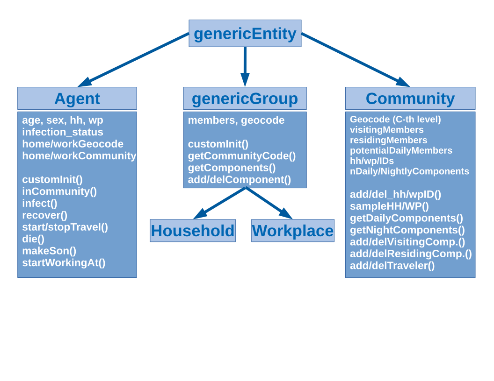
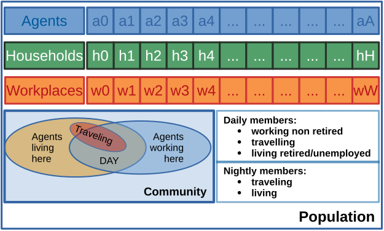
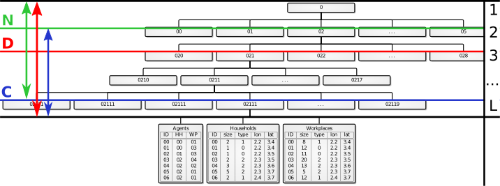

# protopy

Prototype of the agent based model (serial version).


## Dependencies

- numpy;
- h5py;


## Overview

### Entities

To make the importing procedure from hdf5 tables as flexible as possible we read
the data from the tables converting each row in a dictionary `{columnName:
value}`. This dictionary is then used to initialize the different entities
depending on the table we are reading. An entity can be an agent, a workplace, an
household or a community. All entities are classes defined in `system/entities.py`.
The parent class is the `genericEntity` that can be initialized with a dictionary
whose keys set the instance's attributes names and whose values set the corresponding
value of the attributes. For example:
```python
>>> from system.entities import genericEntity
>>> e = genericEntity({"hello": "world", "age": 10})
>>> e.age
10
>>> e.hello
'world'
```


    - The tree of the classes inheritance: the upper class is the `genericEntity`
      from which we derive:
        - `Agent` storing all the information of the agent and providing some basic
          methods to effectively query and set for infection and demography status;
        - `Community` a special kind of group as it has a more elaborated structure
          of components divided in the daily and nightly members. Provides the
          interface to add and delete agents in a consistent way;
        - `genericGroup` simple group with a single set of members from which
          `Household` and `Workplace` are derived.

The `Agent` class inherits from the generic entity and adds a custom init method
where the attributes regarding the epidemics are being set.
The class also has several methods to check if the agent is employed, vaccinated,
atHome etc., plus a series of methods to manipulate its epidemic and travelling
status.

Then, another family of entities is the `genericGroup` used for household and
workplaces. Here we store the ids of the members in a special attribute `members`
(a set of agents ids) and we store the full geocode (i.e., the entire code of the
hierarchy structure to which the household belongs).

The `Community` class directly inherits from the `genericEntity` and has a
somewhat more complex structure.
It has three components set: one for the agents residing (i.e. with the household
in the community), one for the visiting (i.e. the people with the workplace in
this community but the household in another community) and one for the potential
daily members of the community. The last set of agents ids comprehends all the
agents that either live or work in this community. Indeed, when asking a `Community` for the daily agents of the community we check if an agent residing in the community but working somewhere else is at home because of countermeasures (like quarantine).  Travelers visiting one community are treated as if they were residing in the community and they are assigned to an household and to a workplace (if it is a business travel) in the target community. When they end travelling they are removed from the residential and potential daily users sets of the community. When starting a travel we avoid the agent to travel toward the residing and working communities.


    - The structure of the population: we have mainly four dictionaries
      (hash-tables) containing the `{id: object}` mapping for the agents, the
      households and the workplaces. The fourth collection is the one collecting
      the communities. Each community has the id of the geocode cut at the $C$-th
      level. The community has three sets inside containing the ids of:
        - the agents living in the community (residing members);
        - the agents working in the community but living in another community
          (visiting memebers);
        - the agents potentially found in the community during the day. These are
          made up by:
            - people that live in the community;
            - people living in other communities but working in this one;
            - people travelling in the community;
         From this set we can ask the community for the actual daily members
         through the `getDailyComponents` method. This will return the ids of:
            - people living here and not currently travelling that are either
              retired home for illness or unemployed or that work in the same
              home community;
            - people commuting to the community that are not retired home or
              travelling;
            - travellers visiting the community.

     The night members of the community are simply given by the residing members
     minus the travelling ones.


### Geocode

The population is organized in $L$ levels of a hierarchical representation.
We make two assumptions:
- the workplaces and households must be assigned to the lower level of the
  hierarchy, i.e., they must be assigned to a $(l_1, l_2,..., l_L)$ code;
- the community level $C$ is defined in a level between 1 and L, i.e., the agents residing in one community $c = (l_1, l_2,..., l_C)$ are all the agents living in an household whose first $C$ levels of the geocode are equal to $c$.

We have to specify the columns of the hdf5 file where these $L$ levels of
hierarchy are stored as well as the level at which we define the community.

The `geocode` field of the `Household` and `Workplace` entities stores the
complete hierarchy code of the hh (thus with $L$ levels of codes). This code can
be accessed with `household.getGeocode()`. Instead, when we ask for `household.getCommunityCode()` we get the `geocode` cut to the $C$-th level.

The `Community` entity instead stores in the `geocode` attribute only the first
$C$ levels of the hierarchy code and has only the `self.getCommunityCode` method.


    - The `L` levels of the hierarchical structure: the `N` value sets the level at
      which the structure will be divided between nodes (to be implemented). The `D`
      level sets the level at which demography statistics is defined (see below for
      details) and is unbounded, i.e., $1 \le D \le L$. Finally, the `C` level sets
      the level at which the community is defined. The `C` value is bound to be $1
      \le C \le N$.


### Time

So far we use this conventions:
- we set in the configuration the date corresponding to the first step of the simulation in `initialDate`;
- the time increment corresponding to each simulated step in hours is specified in
  the `hoursPerStep` field;

### Dynamics

The dynamics is composed by 4 steps:
- **daily step**: agents interact in their home, work or travel destination community
  and in their workplace with co-workers (if they are at work) or at home with other
  members of the household (if they both are at home);
- **night step**: agents interact in their home community with all the agents living
  in the same community and in the same household with the other household members.
  People travelling act as if they actually live in the destination community (see
  next step);
- **travel step**: for each agent we let him travel with a given probability and we
  select the length and the kind of travle (i.e., either a leisure or business
  travel) from a given travel length distribution and with a given
  business/non-business travel kind. When an agent is travelling he chooses at random
  a destination community and he gets assigned to an household and a workplace (if
  this is a business trip) in the target community. The agent then acts as if he was
  living and working in the assigned community until the end of her journey;
- **demography step**: in the demography step every agent alive dies with a
  probability given by the death probability for her age and sex. If the agent dies
  she is removed from the home and work communities, from her household and, if
  working, from her workplace. At the current stage we leave the agent in the system
  and the agent gets serialized in the following steps. However, the agent takes no
  more part in the dynamics as it is removed from the daily and nightly members of
  her home/work community.
  Regarding the natality step, for each female in the system that covers the role of
  adult (i.e. it is not a child) can give birth to a baby with the probability given
  in the demography table. The son is created using the `Population._giveBirth`
  method that calls the  mother's `Agent.makeSon` method that initialize an agent
  sharing the same household and home community with the mother. The newborn child is
  then assigned to a kindergarten in either the home or work community of the mother.
  If no kindergarten are present in these two communities the children is set to stay
  at home during the day.


## Usage

To use the model there are four main tasks to be done: i) prepare the synthetic
population, ii) configure the parameters of the simulation, iii) run the simulation
and iv) get the output.

### Input preparation

The input needed for the simulations is composed by a synthetic population and a
configuration file.

#### Synthetic population

For the synthetic population rely on our generation tool found in the `git` repo
under the `pilots/healthHabits/modelImplementation/v0.2_custom_implementation/synpop`
folder.
If you have your own synthetic population the hdf5 file format intended as the
input of the model is as follows:

```
* root
|
|-- * agent
|   | id | sex | age | hhid | wpid | status | role | employed | education |
|   | 00 |  0  |  12 |   00 |   00 |    0   |  01  |    1     |     2     |
|
|-- * household
|   | id | l0 | l1 | l2 | size | kind | lon | lat |
|   | 00 |  0 |  1 |  3 |   5  |   2  | 1.1 | 2.2 |
|
|-- * workplace
|   | id | l0 | l1 | l2 | size | kind | lon | lat |
|   | 00 |  0 |  1 |  3 |   5  |   2  | 1.1 | 2.2 |
|
```

where the `hhid` and `wpid` of the agents must be found in the `id` column of the
household and workplace datasets. Also, `l0`, `l1`, ..., are the level codes of the
hierarchy of the population.

Once you have your table ready you should configure the table import in the
`configuration.py` file. Specifically you have to set which dataset corresponds to
the agents, households and workplaces, e.g. `householdsDatasetName = "household"`.

Then you have to set the name of the columns required for the system to load:
- agents: `id,sex,age,role,hh,wp`;
- workplace/household: `id,size,kind,lat,lon`. Here kind refers to a code
  indicating the kind of workplace (school, manufacture, etc., note that schools
  are treated as workplaces!);

These column names will be translated to the default attribute names in the agent,
household, workplace ids.

Additional column names and the corresponding attributes name can be set in the
`additional*AttributesColumns` where you can set the `{columnName: attributeName}`
mapping, i.e., the value in the column named `columnName` will be stored in
`agent.attributeName`.


**Demography**

In this version we also have a basic demography that must be set in a dataset of the
synthetic population hdf5 file. We assume the statistic of demography are found in a
level of details $D$ which is defined at an arbitrary level `D`, i.e., $1 \le D \le
L$. The demography so far covers mortality and natality rates per agent sex and age.
Specifically, the structure of the dataset is the following
```
* root
|
|-- * agent
|
|-- * household
|
|-- * workplace
|
|-- * demography
|   |
|   | l0 | l1 | ... | lD | date     |  sex | age |  natality | mortality |
|   |  4 |  2 | ... |  1 | YYYYMMDD |    0 |  12 | 0.0000000 |   0.00001 |
|   |  4 |  2 | ... |  1 | YYYYMMDD |    1 |  12 | 0.0000001 |   0.00001 |
|
```

Where `time` is a string representing the date in real world time (the format of
this column can be set in the configuration file).
During the simulation at step `T` we use the value stored in the larger time lower
than or equal to `T`, i.e. if we have demography data measured at dates `[20100101,
20110101, 20120101, 20130101]`  (with the implicit `YYYYMMDD` format) and we are at
step number 385 (with one step equal to one day) and starting date equal to
`20100101` we use the data of time `20110101` (we can think about linear
interpolation between two data points for the intermediate points in future
versions).
We treat mortality and birth rates as the probability `p(a,s,d)` for an agent of a
given age `a` and sex `s` to die and give birth to a child in the specific date `d`
during one year.

The probability to die/give birth to a child for each demography step will be then
computed as `p(a,s,d)*daysBetweenDemographyUpdate/365.0`.
The time between two demography updates can be set as the number of steps between two
updates in the `stepsBetweenDemography` parameter in the configuration file. This
parameter together with the `hoursPerStep` one will determine the value of the
`daysBetweenDemographyUpdate` variable used before.

Since we still simulate short time range we make the following assumptions:
- households and workplaces are fixed (i.e., no unemployment dynamics and no
  household recombination);
- the maximum age is 100 years, after which an agent automatically dies with
  probability 1;
- we let only female agents with the role of parents to give birth to new children;
- we do not bound the birth of new children to the household structure (e.g., we
  do not account for the decrease in the pregnancy probability for a girl that
  already has many children).


#### Parameters and configuration

Set the configuration and the simulation parameter in the `configuration.py` file.

The file is quite self-explaining and you can directly use it as a reference.


### Running the model

See the `main.py` script for a basic usage. At the current stage the model simulates
a basic `SIR` process with given infection and relapse rates.


### Output analysis

The output consists in an hdf5 file with the following structure:
```
* root
|
|-- * processor
|   |
|   |-- * run_number
|   |   |
|   |   |-- * time_step
|   |   |   | id | sex | age | status | infection_time | infection_source | demo_status | death_cause |
|   |   |   |  0 |   1 |  18 |    2   |      12        |        0         |       0     |     0       |
|
|-- * timeSteps
|   |
|   | stepNumber |  date   |
|   |     00     | YYYMMDD |
```

The structure and the attributes to be saved can be set in the `World.saveStep`
method (in the future they will be set in the configuration file).

With respect to the output file structure we suggest the following modification:

```
* root
|
|-- * data
|   |
|   |-- * processor
|   |   |
|   |   |-- * run_number
|   |   |   |
|   |   |   |-- * time_step
|   |   |   |   | id | sex | age | status | infection_time | infection_source | demo_status | death_cause |
|   |   |   |   |  0 |   1 |  18 |    2   |      12        |        0         |       0     |     0       |
|
|-- * timeSteps
|   |
|   | stepNumber |  date   |
|   |     00     | YYYMMDD |
|
|-- * parameters
|   |
|   |   parName   |  value |
|   |  param_01   |   12   |
```

So as to include more information and simplify the aggregation procedure in the
output file.

Please refer to our analysis using spark in the `pilots/healthHabits/modelImplementation/v0.2_custom_implementation/postprocess` folder in the `git` repo.


## Parallelization


### Notes

The current implementation has been put forward with parallelization in mind.
Indeed, the update of an agent's status is simply done by changing its inner
variables and by calling specific methods of the community/workplace/household he
belongs to at the population level (for example the whole burden of starting/stopping
an agent travel is done by calling `population._startAgentTravel(agent, time)` and
`populatin._stopAgentTravel(agent)`.

Given the model structure an agent can be found in three different places:
- the community where he lives;
- the community where he works;
- (potentially) the community where he is currently travelling;

In order to parallelize the program we would proceed as follows:
- split the hierarchy tree accordingly to the `N` level (see above for details);
- make a `Population` instance on each of the computing nodes `c` containing all the
  agents living or working in the communities under the `c`-th leaf of the hierarchy
  tree cut at level `N`;
- each population instance stores a global mapping of `{community: computingNode}` to
  send/receive updates to/from the right location;
- use the home community as the reference community for each agent, i.e. all the
  updates due to demography or population structure changes must be performed here
  and then be broadcast to the other nodes containing a copy of the agent;
- mark an agent as alien if its copy is on a node different to the one where the copy
  stands (either putting an additional attribute or maintaining a set of alien
  agents): in this way we know that whenever an update to the agent happens we have
  to send an update to the home node;
- in the same way, every time an agent gets modified in his home node the node marks
  the update to be sent to the other nodes containing the copy of the agent (work
  and/or travelling node);
- updates are queued during the day/night/travel steps and sent at the end of each
  step;


### Scheme

- For the parallelization we would initiate a `World` instance on each node,
adding to the class an attribute `inPlaceGeoCodes` containing the set of codes (cut at the
level of node splitting $N$) that are residing on the node. Then, another attribute
`geoCodesMap` would store a dictionary whose keys are the geocodes of the areas in
the whole system (cut to the $N$ splitting level as well) and whose keys are the rank of
the computing nodes storing the communities and nodes residing/working under that geocode.

- Also, we would add a set of three attributes to each agent, storing the node rank of
the computing nodes containing the community where the agent is residing (home
community), working (daily community) and possibly travelling (visiting
community). This is intended to speed up the decision process on whether to
broadcast or not an update of the agent to other nodes. In other words, thanks to
these attributes one can quickly assert if the update of an agent changing its status
(say at home) has to be broadcast to another node containing the workplace or not.

- During each day and night step the updates (changes of status for an agent) are
computed and appended to two lists: one is for the in place updates and another is
for the out of nodes updates. Each update contains all of the information to be
sent to other nodes to update the status of the agent. For example, an update
reporting the infection of an agent reports `(targetNode, agent.id, infectionStatus, infectionSource,
infectionTime)`, so that the source node sends to `targetNode` the id of the agent
and the new status of the infection for that agent.

- The `travelStart` step is changing only the agents residing in the node (i.e. the ones with the household on the node).
 If the destination community is on a different node we
  send a copy of the agent to the destination node and let the destination
  community to take care to insert it into an household and workplace. The
  destination community checks if the agent is already in the local copy of the
  world (the agent may be travelling to a node already containing it because it
  works on that node) and, if not, it add it to the `_agents` dictionary.

- On the other hand, the `travelStop` method is going to be self contained as all
  of the updates on the agent status are performed and broadcast during the other
  steps. In this step both the home and work community know that the agent is
  coming back and the visited community just check if the agent has to be removed
  from the dictionary (i.e., if the agent copy was on the visiting node only
  because of travel or also because of its work/home locations).

- The `demographyStep` is also performed only by the home node of the agent. In
  this case an existing agent may die: a message with a specific tag
  and containing the agent id is sent to the working and possibly to the visiting
  node of the agent to remove the agent from the local copies of the system.
  When an agent is spawned, the node creates a new agent with an id equals to
  `nextID = nextID + nodeRank`, where `nextID` is initially set to `nextID =
  maxID`, being `maxID` the maximum agent id found at the start of the simulation
  in the overall population. The agent is then assigned to the home and kindergarten
  community by sending its copy to the school node if this is different from the home node.

  The age increment and all the other trivial updates of the demography step are
  separately computed by all the nodes on all the copies of the agents and are then
  not broadcast to save communication time.


    - The possible sources of changes (coloured text) and the places where they
      should be broadcast (arrows) for the agent's attributes in the "worst case
      scenario" (i.e. the case where an agent works in one node, resides in
      another and is travelling to a third one).
      The `travelStop` step is always self-contained as each node knows how to
      handle the end of a travel without interacting with the others.
      The updates coming from the node visited for travelling are obviously due
      only while the agent is travelling. In this case the work and home nodes are
      not performing any update on the agent and are instead waiting for changes
      from the visited node (until the end of the journey or until a demography
      step).


## TODO list

### Configuration/input
- make the configuration more maintainable using YAML;
- avoid using `from configuration import *` and explicitly import all the relevant
  variables (or configuration instance with YAML);
- initialize all the modules with a single import of the configuration in the
  initialization of the `World` class, so that we can specify the configuration file
  for each run;
- find a cleaner way to keep track of the run number (currently using a file in the
  root folder but not scaling with multiple concurrent program executions);
- prepare the input for the travel management (origin/destination matrix, travel
  length distribution);
- optimize the demography table import procedure (by now quite slow);


### Dynamics/model
- deploy more sophisticated travel restrictions based for example on the prevalence
  or on time of the year (e.g. stop travel if prevalence is more than 20%);
- implement the `allowCommuting` option;
- allow for initialization of infection from a dictionary with {community: value} for
  fine tuned infection;
- implement the travel distribution and the origin destination matrix;
- demography accounting for longer time dynamics: child leaving home and forming
  new households, children passing to one school to the other;
- **parallelization**.
- encode the infection, recover and relapse process in a unique set of methods
  instead of dispersing it in the day and night steps (for readability, flexibility
  and code maintenance).

### Output and logging
- use a decent logging system with log level instead of the printouts;
- set the traits and attributes to be serialized in the configuration file.
- serialize the agents born/households-workplaces created during the simulation;


